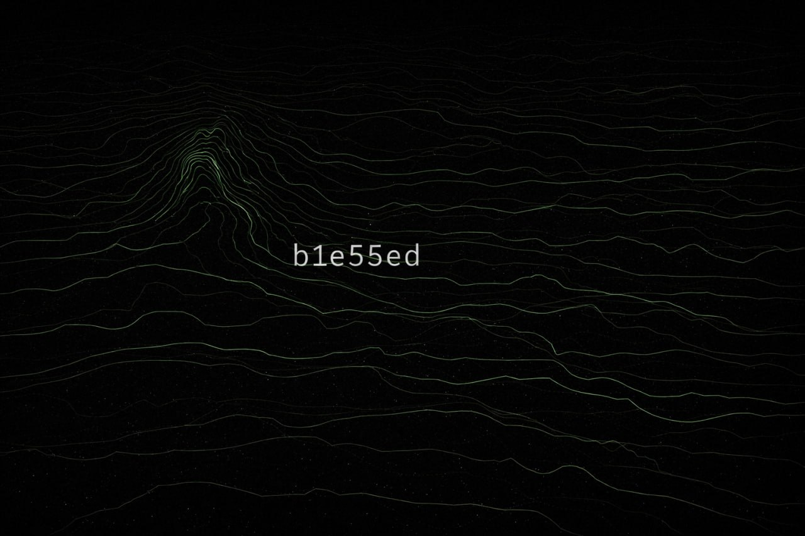

# b1e55ed

<p align="center">
  
</p>

**b1e55ed** (0xb1e55ed = "blessed") — a sovereign trading intelligence system with compound learning.

Built around one primitive: **events**. Producers emit events. The brain reads events and emits events. Execution reads events and emits events. An append-only hash chain makes the system auditable by construction.

[](https://github.com/P-U-C/b1e55ed/actions)
[](https://opensource.org/licenses/MIT)

## Features

- Event-sourced core (append-only DB + hash chain)
- Kill switch gating (operator override)
- CLI control plane (tables or JSON)
- REST API mounted under `/api/v1/`
- Dashboard (read-oriented)
- Dynamic producer registration
- Contributors (registry, scoring, leaderboard)
- Signal attribution (`/api/v1/signals/submit`)
- The Forge (Ethereum-prefixed identity derivation)
- EAS integration (optional off-chain attestations)
- Webhook dispatch (CLI-managed subscriptions)
- Karma / treasury accounting

## Installation

### From source

```bash
git clone https://github.com/P-U-C/b1e55ed.git
cd b1e55ed
uv sync
```

## Quick start

Sequence: forge identity → setup → register contributor → run brain.

```bash
export B1E55ED_MASTER_PASSWORD="your-secure-password"
uv run b1e55ed identity forge
uv run b1e55ed setup
uv run b1e55ed contributors register --name "local-operator" --role operator
uv run b1e55ed brain
```

Start API + dashboard:

```bash
export B1E55ED_API__AUTH_TOKEN="your-secret-token"
uv run b1e55ed api
uv run b1e55ed dashboard
```

- API: `http://localhost:5050/api/v1/health`
- Dashboard: `http://localhost:5051`

## Contributors

Contributors are the attribution unit for signals. They are used for:

- signal provenance (`contributor_id`)
- contributor scoring and leaderboard
- optional EAS attestations

Docs: [docs/contributors.md](docs/contributors.md)

## The Forge

The Forge derives an Ethereum identity with a `0xb1e55ed` prefix.

Docs:
- [docs/FORGE_SPEC.md](docs/FORGE_SPEC.md)
- [docs/getting-started.md](docs/getting-started.md)

## EAS integration

EAS integration is optional and supports off-chain attestations.

Docs: [docs/eas-integration.md](docs/eas-integration.md)

### Distribution

The operator distribution artifacts are checked into this repository:

- `skill.json` — ClawHub metadata for discoverability and installation
- `setup_operator.sh` — one-command operator setup (installs dependencies and runs `b1e55ed setup`)
- `crons.json` — OpenClaw cron templates for brain cycles, health checks, and position monitoring

## Documentation

<<<<<<< HEAD
- [Getting Started](docs/getting-started.md) - Setup, concepts, troubleshooting
- [Configuration](docs/configuration.md) - Presets, weights, risk settings
- [API Reference](docs/api-reference.md) - REST endpoints, examples
- [Deployment](docs/deployment.md) - Production hosting, security
- [Learning Loop](docs/learning-loop.md) - How weights auto-adjust
- [OpenClaw Integration](docs/openclaw-integration.md) - Operator layer, agent-first design
- [Operator Sprint Plan](docs/OPERATOR_SPRINT_PLAN.md) - beta.2 operator layer build plan (O1-O4)
- [EAS Integration](docs/eas-integration.md) - Ethereum Attestation Service for contributor registry
- [The Forge Spec](docs/FORGE_SPEC.md) - Identity derivation ritual specification
- [Agent Producer Tutorial](docs/tutorial-agent-producer.md) - Build a signal producer for b1e55ed

## Architecture

### Event-Sourced Core

```
Producers → Events → Database (hash chain) → Brain → Conviction → Execution → Events
                          ↑                                              ↓
                          └──────────────────────────────────────────────┘
```

Everything is an event. Producers don't push to the brain — they write events. The brain doesn't call producers — it reads events. The hash chain makes every decision auditable.

### Brain Cycle (6 Phases)

1. **Collection** - Gather signals from 13 producers
2. **Quality** - Monitor data freshness and staleness
3. **Synthesis** - Multi-domain weighted scoring (PCS)
4. **Regime** - Detect market state (EARLY_BULL | BULL | CHOP | BEAR | CRISIS)
5. **Conviction** - PCS + counter-thesis scoring (CTS)
6. **Decision** - Generate trade intents with sizing

### Producers (13 Signal Sources)

| Domain | Producers | Data |
|--------|-----------|------|
| **Technical** | TA, Orderbook, Price Alerts | RSI, MACD, volume, levels |
| **On-chain** | On-chain, Stablecoin, Whale | Flows, wallets, cluster tracking |
| **TradFi** | TradFi, ETF | CME basis, funding, ETF flows |
| **Social** | Social, Sentiment, ACI | TikTok, Fear & Greed, CT intel |
| **Events** | Events | Economic calendar |
| **Curator** | Curator, Contract | Human operator signals |

### Kill Switch (5 Levels)

Auto-escalating risk protection:

- **L0 NOMINAL** - Normal operation
- **L1 CAUTION** - Daily loss limit hit (-3%)
- **L2 DEFENSIVE** - Portfolio heat exceeded (6%)
- **L3 LOCKDOWN** - Crisis regime detected
- **L4 EMERGENCY** - Max drawdown breached (-30%)

System **cannot de-escalate automatically** — only operator override.

### Learning Loop

Domain weights auto-adjust monthly based on realized P&L attribution:

```python
# Correlation: domain performance → profit
if domain_score_high and trade_profitable:
    increase_weight(domain)

# Bounded: 5% floor, 40% ceiling, max ±2% delta per cycle
```

## Development

### Tests

```bash
# 196+ tests
uv run pytest -q
```

### Lint and format

```bash
uv run ruff check engine/ api/ tests/
uv run ruff format engine/ api/ tests/
```

## License

MIT
