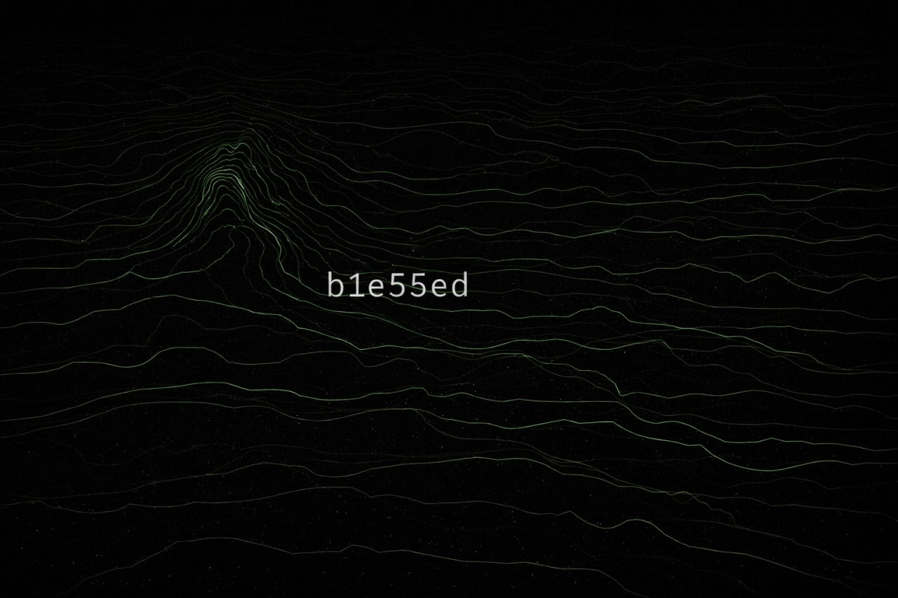

# b1e55ed

<p align="center">
  
</p>

[](https://github.com/P-U-C/b1e55ed/actions)
[](https://opensource.org/licenses/MIT)

---

**A sovereign trading intelligence system.**

It's not a mechanism. It's an organism.

Mechanisms execute. Organisms adapt. b1e55ed learns from every signal, every trade, every regime shift. Conviction weights update. Producer scores evolve. The corpus grows. The system you deploy today is not the system running six months from now.

That's not a feature. That's the point.

---

## How it works

One primitive: events. Everything is an event.

Producers emit signals. The brain synthesizes them into conviction. Execution acts on conviction. Every step writes to an append-only hash chain. The chain is the audit trail — not the logs, not the docs, not a dashboard that lies.

```
Producers → Brain → Execution
     ↑                    ↓
     └──── Compound ◄─────┘
```

---

## What's built

| Layer | |
|-------|-|
| Event core | Append-only database with hash chain. Auditable by construction. |
| Brain | Multi-domain synthesis. Regime-conditioned conviction scoring. |
| Execution | Dynamic Kelly sizing. Kill switch gating. |
| Contributors | Signal provenance. Karma accounting. EAS attestations. |
| Agent interfaces | SSE event stream. MCP server. Signal attribution. |
| CLI | Full operator control plane. |
| REST API | Mounted at `/api/v1/`. Token auth. |

---

## Start

```bash
git clone https://github.com/P-U-C/b1e55ed.git
cd b1e55ed && uv sync

export B1E55ED_MASTER_PASSWORD="..."
uv run b1e55ed identity forge
uv run b1e55ed setup
uv run b1e55ed contributors register --name "you" --role operator
uv run b1e55ed brain
```

API + dashboard:

```bash
export B1E55ED_API__AUTH_TOKEN="..."
uv run b1e55ed api        # http://localhost:5050/api/v1/health
uv run b1e55ed dashboard  # http://localhost:5051
```

→ [Getting started](docs/getting-started.md)

---

## Docs

- [Getting started](docs/getting-started.md)
- [Contributors](docs/contributors.md)
- [EAS integration](docs/eas-integration.md)
- [Operator sprint plan](docs/OPERATOR_SPRINT_PLAN.md)

---

**[Permanent Upper Class](https://github.com/P-U-C)**
